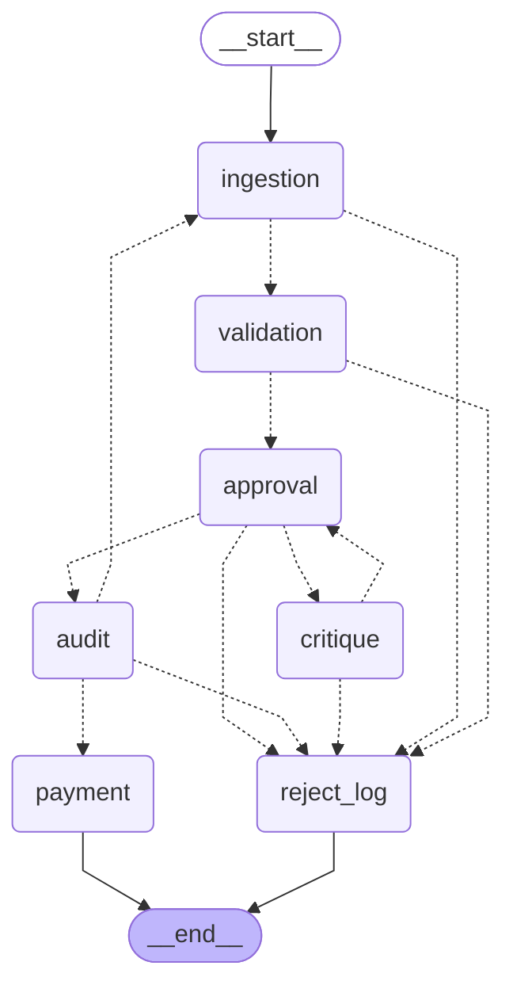

# Invoice graph

Generated from the compiled LangGraph `StateGraph`. Regenerate with `python3 scripts/export_graph.py`.

```mermaid
---
config:
  flowchart:
    curve: linear
---
graph TD;
	__start__([<p>__start__</p>]):::first
	ingestion(ingestion)
	validation(validation)
	approval(approval)
	critique(critique)
	audit(audit)
	payment(payment)
	reject_log(reject_log)
	__end__([<p>__end__</p>]):::last
	__start__ --> ingestion;
	approval -.-> audit;
	approval -.-> critique;
	approval -.-> reject_log;
	audit -.-> ingestion;
	audit -.-> payment;
	audit -.-> reject_log;
	critique -.-> approval;
	critique -.-> reject_log;
	ingestion -.-> reject_log;
	ingestion -.-> validation;
	validation -.-> approval;
	validation -.-> reject_log;
	payment --> __end__;
	reject_log --> __end__;
	classDef default fill:#f2f0ff,line-height:1.2
	classDef first fill-opacity:0
	classDef last fill:#bfb6fc

```
